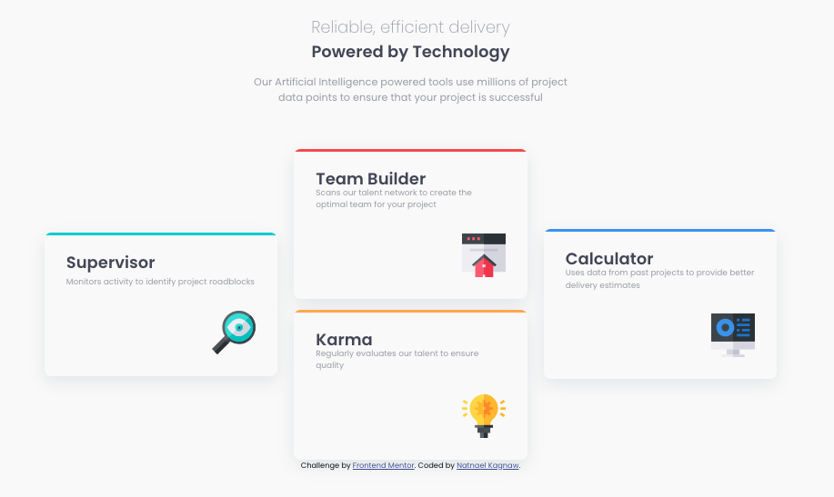

# Frontend Mentor - Four card feature section solution

This is a solution to the [Four card feature section challenge on Frontend Mentor](https://www.frontendmentor.io/challenges/four-card-feature-section-weK1eFYK).

## Table of contents

- [Overview](#overview)
  - [The challenge](#the-challenge)
  - [Screenshot](#screenshot)
  - [Links](#links)
- [My process](#my-process)
  - [Built with](#built-with)
  - [What I learned](#what-i-learned)
  - [Continued development](#continued-development)
  - [Useful resources](#useful-resources)
- [Author](#author)
- [Acknowledgments](#acknowledgments)

## Overview

### The challenge

Users should be able to:

- View the optimal layout for the site depending on their device's screen size

### Screenshot

### Links

- Solution URL: [Github Link](https://github.com/NatnaelSisay/four-card-feature-section-master)
- Live Site URL: [Netlify Link](https://resilient-gecko-222a5e.netlify.app/)

## My process

### Built with

- Semantic HTML5 markup
- CSS custom properties
- Flexbox
- CSS Grid
- Mobile-first workflow

### What I learned

### Continued development

Use this section to outline areas that you want to continue focusing on in future projects. These could be concepts you're still not completely comfortable with or techniques you found useful that you want to refine and perfect.

**Note: Delete this note and the content within this section and replace with your own plans for continued development.**

### Useful resources

- [CSS Scan](https://getcssscan.com/css-box-shadow-examples) - This helped me for setting up box shadow with just a click.
- [Josh Comeau](https://www.joshwcomeau.com/css/custom-css-reset/) - The perfect place for CSS Rest.

## Author

- LinkedIn - [Natnael Kagnaw](https://www.linkedin.com/in/natnael-kagnaw/)
- Frontend Mentor - [@NatnaelSisay](https://www.frontendmentor.io/profile/NatnaelSisay)

## Acknowledgments

I would like to thank Front-end mentor and the discord community.
